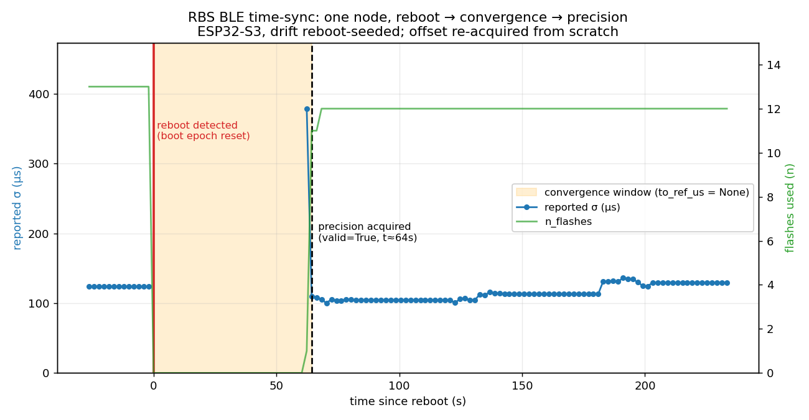

# ble-rbs-timesync

**Relative time synchronization across a fleet of cheap ESP32-S3 nodes — to a few
microseconds — over BLE, with no wire, no GPS, and no shared WiFi clock.**

The nodes sit on different WiFi access points (different channels), so they share no
802.11 TSF, ESP-NOW can't reach between them, and there's no cabling. They synchronize
purely by overhearing each other's existing BLE advertisements.

## Result

Across a live 13-node fleet, the **relative clock-prediction residual between nodes is
4.6–7.7 µs (median 6.8 µs)** — measured over a 2-hour window against a chosen gauge node.


A node that reboots re-locks within ~80 s and its residual settles back into the
single-to-tens-of-µs range as it re-accumulates flashes:



Both graphs are live captures from the running fleet (2026-06-14), reproducible from the
included data — see [results/](results/).

These are **relative** figures between nodes, which is all that matters for the target
application (acoustic time-difference-of-arrival): there is no shared absolute clock and
none is needed.

## How it works

Every node already BLE-advertises its identity ~every 1.5 s (for an unrelated positioning
system). We piggyback a 64-bit hardware-timer timestamp (`tx_us`, restamped faster than the
advertising interval) plus a random per-boot epoch tag into the advertisement's manufacturer
field. Every *other* node that hears that single emission stamps it with its own hardware
timer (`rx_us`).

Because all receivers time the **same emission**, the unknown BLE air-time and the mandatory
0–10 ms advertising delay are a **common offset that cancels** in pairwise receiver
differences `rx_i − rx_j`. What remains is exactly the inter-node clock offset and drift.
A server collects these reports, solves per-node offset + drift relative to one gauge node,
and exposes `to_ref_us(node, local_us)`.

This is classic Reference-Broadcast Synchronization (Elson, Girod & Estrin, OSDI 2002). The
work here is making it reach a few µs *underneath the ESP32's coex hardware*. Full mechanism:
[docs/how-it-works.md](docs/how-it-works.md).

## Working around the hardware

The raw obstacle is a **~1 ms reception-timestamp jitter**. The receive time is stamped in an
app-layer NimBLE callback that fires *at or after* the radio RX — and on the ESP32-S3 the BT
controller, NimBLE host, and WiFi all share one core and one 2.4 GHz radio via software
coexistence. Standard NimBLE exposes no link-layer RX timestamp, so ~1 ms is a hard floor at
the application layer. Pinning the host to a second core and changing coex preference both
made no difference.

Two moves get from a 1 ms jitter floor to a few-µs relative sync:

1. **The jitter is one-sided** (`delay ≥ 0`), so we don't average — we **minimum-filter**.
   Keeping only the cleanest ~30 % of flashes (the ones where every receiver got prompt
   delivery) is a ~1.8× precision win over `√(k−1)` averaging, which would wrongly assume
   symmetric noise. The constant floor-delay folds into a per-node offset that cancels in the
   pairwise difference anyway. → [docs/jitter-wall.md](docs/jitter-wall.md)

2. **Per-node drift persistence** coasts the model through the ~15 s BLE/WiFi coex blackouts
   and seeds a correct drift the instant a rebooted node reappears. This replaced a Kalman
   filter, which lost a live A/B by ~30× — its only advantage (long-gap coasting) never
   materializes because every gap is ~15 s. → [docs/kalman-postmortem.md](docs/kalman-postmortem.md)

## What it's for

Acoustic source localization by time-difference-of-arrival across microphone nodes. With a
few-µs relative sync and a ~5 m array aperture, the downstream geometry gives near-field 3-D
position and ~1° bearing on far sources; range becomes unobservable past a few tens of
metres. The sync layer (this project) and the TDOA geometry layer are cleanly separated.
Details and the full budget: [docs/accuracy.md](docs/accuracy.md).

## Repository layout

```
README.md
docs/
  how-it-works.md     RBS principle, common-offset cancellation, the resolver
  accuracy.md         sync-quality results, drift, the TDOA budget
  jitter-wall.md      the ~1 ms coex floor and the one-sided min-filter that beats it
  kalman-postmortem.md  EKF design, the divergence, the decoupled fix, the live A/B
  integration.md      consuming to_ref_us (live vs offline), drift OLS, reboot handling
rbs/                  Python server: resolver, service, MQTT runner, perf report
  resolver.py  service.py  run.py  report.py
tests/                pytest (12) against the resolver + a real capture
examples/replay.py    offline replay — reproduces the numbers with no hardware
data/capture_v4.jsonl anonymized real tsync_rx capture
firmware/
  components/rbs_tsync/   standalone ESP-IDF component (announce + scan + report)
  example/                buildable two-board demo (MQTT or UART output)
results/              live fleet + reboot-convergence captures, plots, and scripts
```

> **Status:** runnable. The Python server (`rbs/`) and the ESP-IDF firmware component
> (`firmware/`) are both extracted and building; offline replay reproduces the numbers
> with no hardware. See [Quick start](#quick-start).

## Quick start

**Server, no hardware** — reproduce the numbers from the included capture:
```bash
pip install -r requirements.txt
python examples/replay.py            # per-node offset/drift + σ_all 658µs → σ_clean 359µs
pytest -q                            # 12 tests
```

**Server, live** — resolve a real fleet off an MQTT broker and report performance:
```bash
python -m rbs.run --broker <host>    # subscribes rbs/tsync_rx/+, serves to_ref_us
python -m rbs.report --plot          # per-node residual table + results/fleet_resid.png
```

**Firmware** — flash three+ ESP32-S3 boards (RBS needs a common transmitter heard by two
receivers, so two boards can't sync — see [firmware/README.md](firmware/README.md)):
```bash
cd firmware/example && idf.py set-target esp32s3 && idf.py menuconfig   # set node letter/id
idf.py -p /dev/ttyACM0 flash monitor
```

## Hardware

- ESP32-S3-N16R8 (16 MB flash, 8 MB octal PSRAM), 13–14 nodes
- NimBLE, active + passive scan, WiFi + BLE software coexistence on one 2.4 GHz radio
- Nodes split across two different-channel WiFi APs (why no shared TSF was available)
- Sync clock is `esp_timer_get_time()` (hardware µs); device clocks are never disciplined —
  the model lives entirely on the server

## License

MIT (see [LICENSE](LICENSE)).

## Acknowledgements

The reference-broadcast principle is from Elson, Girod & Estrin, *Fine-Grained Network Time
Synchronization using Reference Broadcasts* (OSDI 2002). The contribution here is reaching a
few-µs relative sync on commodity coex hardware, and the result that minimum-filtering plus
drift persistence outperforms a Kalman filter in this regime.
