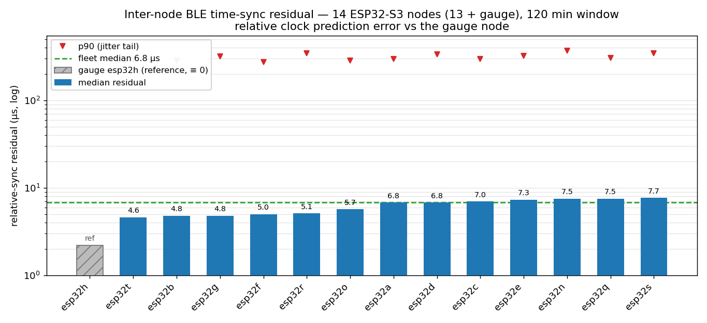

# Sync quality and accuracy budget

## Relative sync residual (the headline)

The quantity that matters is how well two nodes' clocks agree, measured as the **prediction
residual**: the model's prediction of a node's next clean offset measurement, before it sees
that measurement.

Across a live 13-node fleet over a 2-hour window (one node, `esp32h`, is the gauge reference
at offset 0 by definition):

| Statistic | Value |
|---|---|
| Per-node median residual | **4.6–7.7 µs** |
| Fleet median-of-medians | **6.8 µs** |
| Per-node p90 | ~280–370 µs (the one-sided jitter tail) |

The median sits at a few µs; the p90 reflects the one-sided BLE-reception jitter that the
minimum filter suppresses but cannot eliminate (see [jitter-wall.md](jitter-wall.md)). A
freshly rebooted node re-locks within ~80 s and its residual settles back down as it
re-accumulates flashes — [../results/](../results/) shows the full reboot curve.

The resolver also reports a conservative per-node σ (floored at 50 µs) that gates whether a
node is exposed to consumers; that is a deliberately pessimistic bound, distinct from the
prediction-residual median above.

## Relative, not absolute

The mesh is self-referential: one gauge node defines offset 0 and every other node is solved
relative to it. There is no observable absolute or external time, and the target application
does not need one — TDOA depends only on *relative* arrival times. SNTP is logged for
human-readable timestamps but is never used by the resolver.

## Drift and gaps

- **Drift**: per-node crystal drift sits in the −20…+20 ppm range. The drift slope is fit
  per node and persisted, so a 15 s coverage gap at 20 ppm — with drift known — contributes
  ~1.5 µs of error instead of ~300 µs if the offset were held flat.
- **Gaps**: all observed coverage gaps are ~15 s (BLE/WiFi coex blackouts + scan
  scheduling). Drift persistence coasts them; there are no long gaps in practice.
- **Reboot**: a node re-acquires its offset from scratch in ~60–90 s (gated on ≥10 flashes).
  Drift is reboot-seeded from the persisted prior, so the slope is correct from the first
  instant of the new epoch.

## Downstream: what the sync enables (TDOA)

The sync layer feeds an acoustic time-difference-of-arrival localizer. Propagating the
relative timing to geometry, for a microphone array of aperture `D ≈ 5 m`:

| Quantity | Relationship | Approx. value |
|---|---|---|
| Pairwise timing σ | `√2 ×` per-node residual std | a few hundred µs (jitter-tail dominated) |
| Range-difference σ | `c · σ_t` | order ~cm–dm |
| Bearing σ | `σ_Δd / D` | ~1° near broadside |
| Range ceiling | `D² / (8·σ_Δd)` | a few tens of metres |

Practically: near-field sources (within ~1–2 apertures) localize to a 3-D point with four
non-coplanar mics; far sources give **bearing only** — at 300 m, 1 km, and 20 km the
wavefront is effectively planar and TDOA cannot separate them. Range for far sources comes
from amplitude, atmospheric high-frequency absorption, or bearing-rate, not from timing.

The geometry layer is a separate component; this project is the timing layer that provides
`to_ref_us`.
